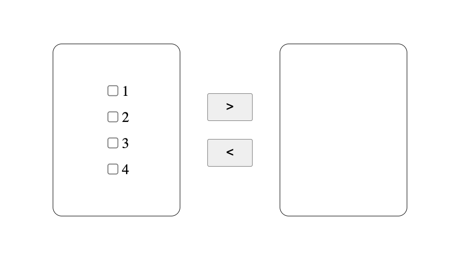

# Transfer List

Welcome to the META React JS interview.

Your task is to build a transfer list component.

A transfer list allows users to pass items from one list to another.
UX has provided a mock up:

1. The transfer list should consists of two lists with directional actions buttons.
2. The user should be able to select one or multiple items and move the item to the other list by clicking the action buttons.
